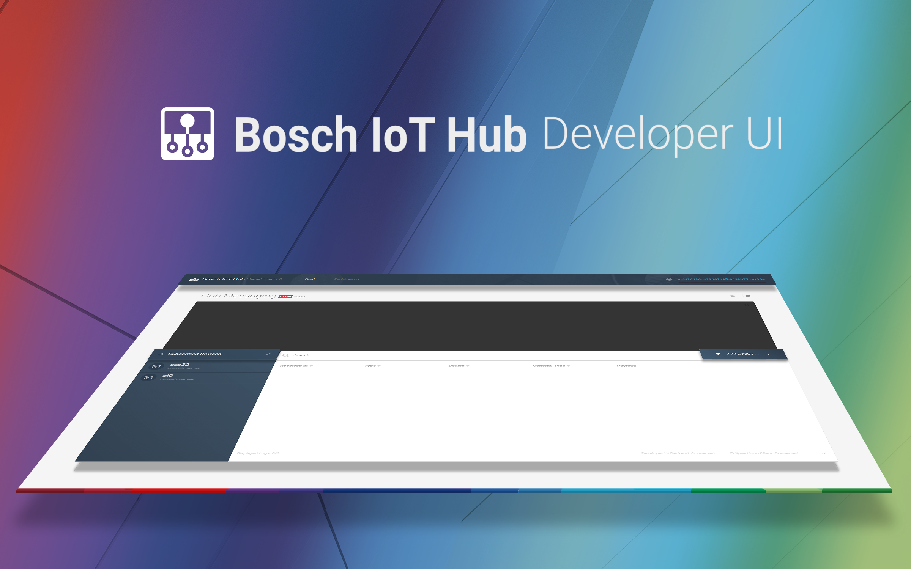

<br />

<h1 align='center'>
  Bosch IoT Hub Developer UI  
</h1>
<h3 align='center'>Example application for the Bosch IoT Hub. </h3>

<br />



## About

The Bosch IoT Hub Developer UI helps you to quickly get used with the Bosch IoT Hub and its concepts. 
Using it you can quickly create devices and credentials for your existing IoT devices and see the device data flowing through the IoT Hub.

## Feature Overview

The following features are available:

* Display incoming telemetry messages
* Display incoming event messages
* Register new devices and credentials
* View devices and their credentials

## Usage
* Download the current release from our github release page: [Releases](https://github.com/bsinno/iot-hub-devui/releases).
Alternatively you can clone the repo and build the source code on your own. 

* To use the Hub Developer UI you will need a Bosch IoT Hub Tenant. There is a free service plan offering available: [Bosch IoT Hub][1]

* The configuration of the Hub Developer UI is performed in the `application.properties` file. Before you can use the Hub Developer UI you must configure your tenant credentials in this file.

* Once configured you can start the application using: 
`java -jar iot-hub-developer-ui.jar`

* Once started you can access the application using your browser:
[http://localhost:8080/hubdev/ui](http://localhost:8080/hubdev/ui)

### Proxy Usage
Some environments require the use of a http proxy server to connect to the internet. The Bosch IoT Hub Developer UI allows the configuration of a http proxy server using the followings java properties:
```
java -jar -Dhttps.proxyHost=myProxyServer.local -Dhttps.proxyPort=3128 -Dhttps.proxyUser=myUser -Dhttps.proxyPassword=myPassword iot-hub-developer-ui.jar
```

The connection to the IoT Hub Messaging is performed using an AMQP 1.0 connection. 
If your environment doesn't allow direct connections to external amqp hosts, but provides a special forwarding host you can configure it like this in the `application.properties`:

```
hub.client.host = 12.34.56.789
hub.client.hostnameVerificationRequired = false
```

The hostname verification must be disabled in this case, as the hostname will not match the one of the tls certificate.

## Limitations
* The Bosch IoT Hub Developer UI is not intended as a network hosted application. 
Therefore no further security measurements are in place. Incoming connections are restricted to localhost

* The Bosch IoT Hub Load balances outgoing traffic among its connected consumers. 
If you already have an application connected to your tenant and the Bosch IoT Hub Developer UI is started load will be balanced between those two consumers.


## Acknowledgments
A list of used open source libraries and other third party materials you can find [here][2]

[1]: https://www.bosch-iot-suite.com/hub/
[2]: Acknowledgments.md